# 🔥 Complete PyTorch Learning Journey

<div align="center">


*From Zero to Hero: A complete hands-on journey through PyTorch fundamentals, neural networks, computer vision, and custom datasets*

[](https://colab.research.google.com/github/Satish-vaishyar/Learning-Pytorch/blob/main/pytorch_fundamentals.ipynb)
[](./pytorch_fundamentals.ipynb)

</div>

---

## 🎓 Complete Learning Path

This repository contains a comprehensive PyTorch learning journey covering everything from basic tensor operations to advanced computer vision and custom datasets. Perfect for anyone wanting to master deep learning with PyTorch!

### 📚 Course Structure

<details>
<summary>🔧 <strong>Chapter 0: PyTorch Fundamentals</strong> (Current)</summary>

**📖 Notebook:** [`pytorch_fundamentals.ipynb`](./pytorch_fundamentals.ipynb)

**🎯 What you'll learn:**
- Tensor operations and manipulations
- PyTorch basics and NumPy integration
- Random tensors and reproducibility
- Foundation for all future chapters

**📊 Progress:** ✅ **Completed**

</details>

<details>
<summary>🗺️ <strong>Chapter 1: PyTorch Workflow</strong> (Coming Next)</summary>

**🎯 What you'll learn:**
- End-to-end PyTorch machine learning workflow
- Creating datasets with linear regression
- Training and test set splitting
- Building your first PyTorch model
- Loss functions and optimizers
- Training and testing loops
- Model saving and loading

**📊 Progress:** 🔄 **In Progress**

**🔗 Key Topics:**
- `torch.nn.Module` and model building classes
- PyTorch training loop intuition
- Model predictions and evaluation
- Putting everything together

</details>

<details>
<summary>🤨 <strong>Chapter 2: Neural Network Classification</strong></summary>

**🎯 What you'll learn:**
- Machine learning classification fundamentals
- Classification neural network architecture
- Converting data to tensors for classification
- Using `torch.nn.Sequential`
- Loss, optimizer, and evaluation for classification
- From logits to probabilities to predictions
- Non-linearity and activation functions
- Multiclass classification problems

**📊 Progress:** ⏳ **Planned**

</details>

<details>
<summary>� <strong>Chapter 3: Computer Vision</strong></summary>

**🎯 What you'll learn:**
- Computer vision fundamentals
- Convolutional Neural Networks (CNNs)
- TorchVision library
- Working with image datasets
- Mini-batches and DataLoaders
- GPU acceleration for vision tasks
- CNN architecture design
- Image classification and evaluation
- Confusion matrices for model evaluation

**📊 Progress:** ⏳ **Planned**

</details>

<details>
<summary>🗃️ <strong>Chapter 4: Custom Datasets</strong></summary>

**🎯 What you'll learn:**
- Creating custom datasets from scratch
- Working with real-world image data
- Custom dataset classes with `torch.utils.data.Dataset`
- Data augmentation techniques
- Building baseline models
- Model performance analysis with `torchinfo`
- Handling overfitting and underfitting
- Making predictions on custom data

**📊 Progress:** ⏳ **Planned**

</details>

---

## �📚 What You'll Learn (Chapter 0: Fundamentals)

This interactive Jupyter notebook takes you through the essential concepts of PyTorch, covering everything from basic tensor operations to advanced manipulations. Perfect for beginners starting their deep learning journey!

### 🎯 Learning Objectives

<details>
<summary>🧮 <strong>Tensor Fundamentals</strong></summary>

- **Scalars, Vectors, Matrices & Tensors**: Understanding the building blocks
- **Tensor Creation**: Multiple methods to create tensors
- **Data Types**: Working with different tensor dtypes
- **Device Management**: CPU vs GPU tensor operations

</details>

<details>
<summary>🎲 <strong>Random Tensors & Reproducibility</strong></summary>

- **Random Tensor Generation**: Creating random tensors for neural networks
- **Reproducibility**: Using random seeds for consistent results
- **Tensor Shapes**: Understanding tensor dimensions and shapes

</details>

<details>
<summary>🔢 <strong>Tensor Operations</strong></summary>

- **Element-wise Operations**: Addition, subtraction, multiplication
- **Matrix Multiplication**: Understanding `@` operator and `torch.matmul()`
- **Aggregation Functions**: min, max, mean, sum operations
- **Indexing & Slicing**: Selecting data from tensors

</details>

<details>
<summary>🔄 <strong>Tensor Manipulation</strong></summary>

- **Reshaping**: `reshape()` and `view()` operations
- **Stacking**: Combining tensors with `torch.stack()`
- **Squeezing/Unsqueezing**: Adding and removing dimensions
- **Permuting**: Rearranging tensor dimensions

</details>

<details>
<summary>🤝 <strong>NumPy Integration</strong></summary>

- **NumPy ↔ PyTorch**: Converting between NumPy arrays and PyTorch tensors
- **Data Type Considerations**: Managing dtype compatibility
- **Memory Sharing**: Understanding tensor-array relationships

</details>

---

## 🚀 Quick Start

### Prerequisites

Make sure you have the following installed:

```bash
# Core requirements for fundamentals
pip install torch numpy jupyter

# Additional requirements for future chapters
pip install torchvision torchaudio  # For computer vision
pip install matplotlib seaborn      # For visualization
pip install torchinfo               # For model summaries
pip install requests pillow         # For custom datasets
```

### 🏃‍♂️ Getting Started

1. **Clone the repository**
   ```bash
   git clone https://github.com/Satish-vaishyar/Learning-Pytorch.git
   cd Learning-Pytorch
   ```

2. **Start with Chapter 0: Fundamentals**
   ```bash
   jupyter notebook pytorch_fundamentals.ipynb
   ```

3. **Or use VS Code**
   - Open the folder in VS Code
   - Install the Jupyter extension
   - Open `pytorch_fundamentals.ipynb`

4. **Progress through chapters sequentially**
   - Each chapter builds upon the previous one
   - Complete exercises and challenges in each notebook
   - Experiment with the code to deepen understanding

---

## 📈 Learning Roadmap

```mermaid
graph TD
    A[🔧 PyTorch Fundamentals] --> B[🗺️ PyTorch Workflow]
    B --> C[🤨 Neural Network Classification]
    C --> D[😎 Computer Vision]
    D --> E[🗃️ Custom Datasets]
    
    A -.-> |You are here| F[✅ Tensor Operations<br/>✅ NumPy Integration<br/>✅ Random Seeds]
    B -.-> G[⏳ Training Loops<br/>⏳ Model Building<br/>⏳ Optimization]
    C -.-> H[⏳ Classification<br/>⏳ Non-linearity<br/>⏳ Multiclass]
    D -.-> I[⏳ CNNs<br/>⏳ Image Processing<br/>⏳ GPU Training]
    E -.-> J[⏳ Custom Data<br/>⏳ Data Augmentation<br/>⏳ Model Analysis]
```



---

## 📖 Chapter 0: Fundamentals - Detailed Structure

### 🏗️ Section Overview

| Section | Topic | Key Concepts | Status |
|---------|-------|--------------|--------|
| **1** | 🎯 **Introduction to Tensors** | Scalars, vectors, matrices, tensors | ✅ Complete |
| **2** | 🎲 **Random Tensors** | `torch.rand()`, neural network initialization | ✅ Complete |
| **3** | 🔢 **Zeros and Ones** | `torch.zeros()`, `torch.ones()`, tensor-like operations | ✅ Complete |
| **4** | 📏 **Tensor Properties** | Shape, dtype, device management | ✅ Complete |
| **5** | ➕ **Basic Operations** | Addition, multiplication, element-wise ops | ✅ Complete |
| **6** | 🔄 **Matrix Multiplication** | `@` operator, `torch.matmul()`, shape rules | ✅ Complete |
| **7** | 📊 **Aggregation** | Min, max, mean, sum, argmin, argmax | ✅ Complete |
| **8** | 🔧 **Reshaping & Views** | `reshape()`, `view()`, memory sharing | ✅ Complete |
| **9** | 📍 **Indexing** | Selecting data, slicing operations | ✅ Complete |
| **10** | 🔗 **NumPy Integration** | Array-tensor conversion, dtype handling | ✅ Complete |
| **11** | 🎯 **Reproducibility** | Random seeds, consistent results | ✅ Complete |

---

## 💡 Key Code Examples

### Creating Your First Tensor

```python
import torch

# Scalar (0-dimensional tensor)
scalar = torch.tensor(7)

# Vector (1-dimensional tensor)
vector = torch.tensor([7, 7])

# Matrix (2-dimensional tensor)
matrix = torch.tensor([[7, 8], [9, 10]])

# Tensor (3+ dimensional)
tensor = torch.tensor([[[1, 2, 3], [3, 6, 9], [2, 5, 4]]])
```

### Matrix Multiplication Magic

```python
# Element-wise multiplication
result_1 = tensor * tensor

# Matrix multiplication (the neural network way!)
result_2 = torch.matmul(tensor, tensor.T)
```

### Reproducible Random Tensors

```python
# Set the random seed for reproducibility
RANDOM_SEED = 42
torch.manual_seed(RANDOM_SEED)

# Now your "random" tensors will be the same every time!
reproducible_tensor = torch.rand(3, 4)
```

---

## 🎯 Interactive Features

### 🔍 **Try This Yourself!**

The notebook includes interactive sections where you can:

- **Experiment** with different tensor shapes
- **Modify** random seeds to see how it affects results
- **Test** your understanding with guided exercises
- **Visualize** tensor operations step-by-step

### 💪 **Challenge Sections**

Look out for challenge boxes throughout the notebook:

```python
# 🚀 CHALLENGE: Can you create a tensor that represents a RGB image?
# Hint: Think about height, width, and color channels!
```

---

## 🛠️ Troubleshooting

<details>
<summary><strong>Common Issues & Solutions</strong></summary>

### Issue: "RuntimeError: expected scalar type Float but found Double"
```python
# Solution: Convert tensor dtype
tensor = tensor.type(torch.float32)
```

### Issue: "RuntimeError: mat1 and mat2 shapes cannot be multiplied"
```python
# Solution: Check tensor shapes or transpose
print(f"Tensor A shape: {tensor_a.shape}")
print(f"Tensor B shape: {tensor_b.shape}")
result = torch.matmul(tensor_a, tensor_b.T)  # Transpose if needed
```

### Issue: Import errors
```bash
# Reinstall PyTorch
pip uninstall torch
pip install torch
```

</details>

---

## 🎯 What's Next?

### 🗺️ **Immediate Next Steps (Chapter 1: PyTorch Workflow)**

After mastering these fundamentals, you'll move on to:

- 🏗️ **Building Complete ML Workflows** - From data to deployment
- 📊 **Creating Training/Test Datasets** - The most important ML concept
- 🤖 **Your First PyTorch Model** - Using `torch.nn.Module`
- � **Loss Functions & Optimizers** - `torch.nn` and `torch.optim`
- 🔄 **Training Loops** - The heart of machine learning
- 💾 **Model Persistence** - Saving and loading trained models

### 🎓 **Long-term Learning Path**

Your complete PyTorch journey will cover:

- 🤨 **Neural Network Classification** - Binary and multiclass problems
- 😎 **Computer Vision** - CNNs, image processing, TorchVision
- 🗃️ **Custom Datasets** - Real-world data handling and augmentation
- 🚀 **Advanced Topics** - Transfer learning, model optimization, deployment

### 📚 **Recommended Study Approach**

1. **Complete each chapter sequentially** - Each builds on the previous
2. **Practice with exercises** - Hands-on coding is essential
3. **Experiment and modify** - Try your own variations
4. **Build projects** - Apply concepts to real problems
5. **Join the community** - Engage with PyTorch forums and Discord

---

## 🤝 Contributing

Found a bug or want to improve the notebooks? Contributions are welcome!

1. Fork the repository
2. Create a feature branch: `git checkout -b feature/amazing-feature`
3. Commit your changes: `git commit -m 'Add amazing feature'`
4. Push to the branch: `git push origin feature/amazing-feature`
5. Open a Pull Request

### 💡 **Ways to Contribute**
- 🐛 **Report bugs** or issues in the notebooks
- 📚 **Improve documentation** and explanations
- 🆕 **Add new examples** or exercises
- 🎨 **Enhance visualizations** and plots
- 🧪 **Add unit tests** for code examples

---

## 📁 Repository Structure

```
Learning-Pytorch/
│
├── 📓 pytorch_fundamentals.ipynb    # Chapter 0: Fundamentals (Current)
├── 📝 README.md                     # This comprehensive guide
├── 📄 LICENSE                       # MIT License
│
├── 🗺️ chapter_1_workflow/           # Coming Next
│   ├── 📓 pytorch_workflow.ipynb
│   └── 📊 datasets/
│
├── 🤨 chapter_2_classification/     # Planned
│   ├── 📓 neural_classification.ipynb
│   └── 📊 data/
│
├── 😎 chapter_3_computer_vision/    # Planned
│   ├── 📓 computer_vision.ipynb
│   ├── 📓 cnn_architectures.ipynb
│   └── 🖼️ images/
│
└── 🗃️ chapter_4_custom_datasets/   # Planned
    ├── 📓 custom_datasets.ipynb
    ├── 📊 pizza_steak_sushi/
    └── 🔧 utils/
```

---

## 📝 License

This project is licensed under the MIT License - see the [LICENSE](LICENSE) file for details.

---

## 🙏 Acknowledgments

- **PyTorch Team** for creating an amazing deep learning framework
- **Daniel Bourke** for the comprehensive [PyTorch for Deep Learning & Machine Learning course](https://youtu.be/V_xro1bcAuA?si=3nDNj69okzxxlo6d) 🎥
- **Jupyter Project** for interactive computing environments
- **NumPy Community** for fundamental array computing
- **Open Source Community** for making deep learning accessible to everyone

### 📺 **Course Reference**

This learning journey is based on the excellent **25-hour PyTorch course** by Daniel Bourke:

[](https://youtu.be/V_xro1bcAuA?si=3nDNj69okzxxlo6d)

**Course Title:** *PyTorch for Deep Learning & Machine Learning – Full Course*  
**Duration:** 25+ hours of comprehensive content  
**Instructor:** Daniel Bourke (@mrdbourke)

The notebooks and exercises in this repository follow the course structure while adding personal notes, experiments, and additional examples.

---

<div align="center">

### ⭐ Star this repository if it's helping you learn PyTorch!

**Join the Journey - From Fundamentals to Advanced Deep Learning! 🔥🧠**

[](https://github.com/Satish-vaishyar)
[](https://github.com/Satish-vaishyar/Learning-Pytorch/stargazers)
[](https://github.com/Satish-vaishyar/Learning-Pytorch/network/members)

**Next Chapter Coming Soon: PyTorch Workflow! 🗺️**

</div>
